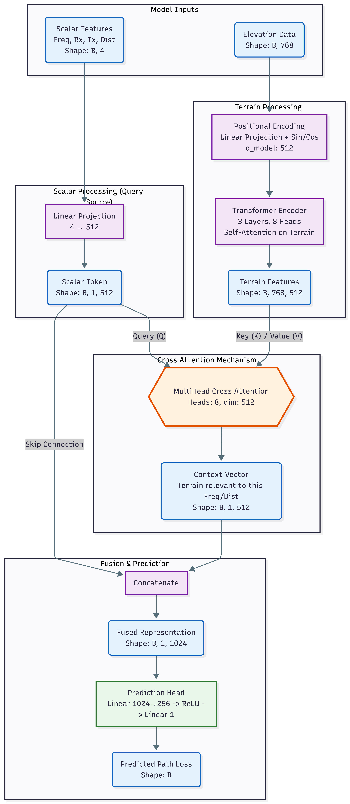
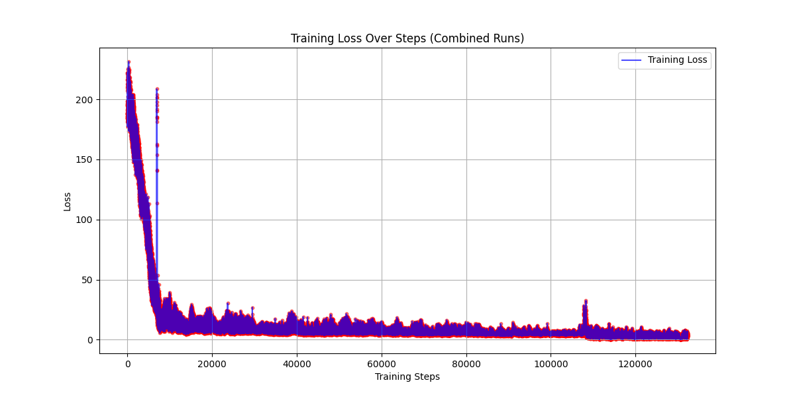

# Transformer-Based Surrogate Model for Irregular Terrain Model Path Loss Prediction

**Authors:** Alex Punnen
<br>
**Date:** February 2026

---

## Abstract

Radio propagation path loss prediction is essential for wireless network planning, coverage optimization, and spectrum management. The Irregular Terrain Model (ITM), also known as Longley-Rice, provides physics-based path loss estimates by analyzing terrain profiles between transmitter and receiver locations. Evaluating millions of candidate links still makes runtime and system efficiency important concerns, motivating investigation of learned surrogates.

We propose a transformer-based neural network surrogate that learns to approximate ITM path loss predictions from terrain elevation profiles and link parameters. Unlike prior deep learning approaches that operate on 2D geographic maps, our method treats the 1D elevation profile along the propagation path as a sequence, leveraging self-attention to capture terrain-induced diffraction and obstruction effects at arbitrary positions. The model ingests the elevation sequence alongside transmission frequency, antenna heights, and link distance to predict path loss in a single forward pass.

Trained on ITM-generated samples spanning the 6 GHz band with distances from 1.3 to 200 km across diverse terrain types, our model approximates ITM path loss to within a few decibels. An initial pipeline reached **17.85 dB RMSE** (median error 5.00 dB), and a subsequently revised pipeline—log-scaled link parameters, explicit terrain mean/roughness features, full-distribution target normalization, and a corrected source-shuffled sampling scheme—reaches **11.01 dB RMSE** (median error 3.80 dB) on a representative, full-loss-range validation set, even from a partially trained checkpoint (Section 4.7). The training dataset is publicly available at `https://huggingface.co/datasets/alexcpn/longely_rice_model/tree/main` (14 GB). These results validate that the transformer architecture can effectively learn terrain-propagation relationships and that the training loss can be driven down substantially with the right data pipeline and normalization. Direct benchmarking on the current workstation shows that the present transformer inference path is still substantially slower than the native ITM implementation: **1314.8 us** per prediction for the model versus **11.0 us** for direct ITM at batch size 64 over 100 timed runs. We have not yet established whether this gap reflects a fundamental limitation of the current model class or a remediable engineering issue in the present implementation, so the current contribution is best interpreted as concept validation rather than acceleration.

**Keywords:** path loss prediction, irregular terrain model, transformer, surrogate modeling, radio propagation, deep learning, 6 GHz, CBRS

**Source code:** [alexcpn/elevation_transformer](https://github.com/alexcpn/elevation_transformer)

---

## 1. Introduction

Accurate path loss prediction is fundamental to wireless network design, enabling engineers to estimate coverage areas, plan cell sites, and manage interference. The Irregular Terrain Model (ITM), developed by Longley and Rice at the Institute for Telecommunication Sciences in the 1960s, remains one of the most widely used propagation models for frequencies between 20 MHz and 20 GHz [1]. ITM accounts for terrain diffraction, tropospheric scatter, and atmospheric effects, making it suitable for diverse propagation environments.

However, modern network planning applications increasingly require path loss estimates for millions of transmitter-receiver pairs. Use cases include:

- **Network densification:** Evaluating thousands of candidate small cell locations against existing infrastructure
- **Dynamic spectrum sharing:** Real-time interference assessment for Citizens Broadband Radio Service (CBRS) and similar frameworks requiring sub-second coordination
- **Drone communications:** Continuous path loss updates along flight trajectories for beyond-visual-line-of-sight operations
- **Digital twins:** Simulating wireless coverage across entire metropolitan areas with millions of potential link combinations

For these applications, large-scale propagation evaluation remains an important systems bottleneck, making surrogate modeling attractive in principle. However, mature native ITM implementations are already highly optimized, so acceleration cannot be assumed a priori and must be established through direct benchmarking.

This paper presents a transformer-based neural network that learns to approximate ITM predictions with high fidelity and uses runtime benchmarking as a secondary diagnostic rather than the primary success criterion. By treating the terrain elevation profile as a sequence and applying self-attention mechanisms, our model captures the complex interactions between terrain features that determine propagation loss. The key insight is that diffraction and obstruction effects depend on the relative positions and heights of terrain features along the entire path—a relationship that self-attention is naturally suited to model.

### 1.1 Contributions

1. **Novel sequence-based formulation:** We frame terrain-based path loss prediction as a sequence-to-scalar regression problem, where elevation samples along the propagation path form the input sequence. This formulation naturally handles variable-length terrain profiles through padding and masking.

2. **Transformer architecture for propagation:** We demonstrate that multi-head self-attention mechanisms effectively capture terrain-induced propagation effects, including diffraction around obstacles at arbitrary positions along the path.

3. **Large-scale surrogate model:** The current hosted corpus contains approximately 32.3 million ITM samples covering the 6 GHz band. The revised model checkpoint received approximately 7.2 million sample presentations across two partial training segments and achieved 11.01 dB RMSE on a representative full-distribution validation set (Section 4.7), an 82% improvement from baseline.

4. **Concept validation with runtime reality check:** We show that attention-based sequence modeling can learn the ITM mapping and reduce loss substantially, while also documenting that the present implementation is not yet competitive with native ITM in inference throughput and that the cause of this gap has not yet been isolated.

---

## 2. Background and Related Work

### 2.1 The Irregular Terrain Model (ITM)

The Irregular Terrain Model, also known as the Longley-Rice model, predicts median path loss as a function of distance, frequency, antenna heights, and terrain characteristics [1]. The model operates in two modes:

- **Point-to-point mode:** Uses detailed terrain elevation data along the propagation path, computing diffraction losses based on the specific terrain profile
- **Area mode:** Uses statistical terrain parameters (terrain irregularity factor) when detailed profiles are unavailable

ITM accounts for three primary propagation mechanisms:

1. **Line-of-sight propagation:** Free-space path loss with adjustments for atmospheric absorption
2. **Diffraction:** Knife-edge and smooth-earth diffraction models for obstacles blocking the direct path
3. **Tropospheric scatter:** Forward scatter mechanisms for beyond-horizon paths at longer distances

The model outputs median transmission loss along with confidence intervals accounting for temporal variability (fading) and location variability (local terrain effects). For the 6 GHz band relevant to CBRS and Wi-Fi 6E applications, ITM provides predictions suitable for both urban fringe and rural environments where terrain dominates propagation.

### 2.2 Machine Learning for Propagation Modeling

Recent work has applied machine learning to path loss prediction with promising results:

**Convolutional approaches:** Levie et al. demonstrated that U-Net style CNNs operating on 2D urban maps containing building geometry and transmitter location can predict dense simulated radio maps with RMSE on the order of 1 dB relative to their simulation targets [2]. Their setting is short-range and urban: 256 m maps and path-loss targets generated mainly by WinProp DPM/IRT simulations rather than drive-test measurements. These methods excel in cluttered urban environments where buildings dominate propagation characteristics. However, they require extensive 2D map data and computational resources for the convolution operations.

**Ensemble methods:** Comparative studies of random forests, gradient boosting, and neural networks for path loss prediction found that ensemble methods often outperform traditional empirical models like Okumura-Hata when trained on measurement data [3]. These approaches typically use aggregate features (distance, frequency, terrain roughness statistics) rather than the full elevation profile.

**Transformer-based methods:** Hehn et al. proposed a transformer architecture for link-level path-loss prediction from variable-sized 2D maps containing buildings and foliage, with continuous transmitter/receiver coordinates and optional sparse measurement inputs [4]. Their work demonstrated that attention mechanisms can identify relevant map regions for propagation prediction and generalize across map sizes. Our work differs by focusing on 1D terrain profiles for rural/suburban environments and by targeting ITM approximation rather than direct measurement fitting.

---

## 3. Methodology

### 3.1 Problem Formulation

Given:
- Terrain elevation profile: $\mathbf{e} = [e_1, e_2, ..., e_N]$ where $e_i$ is elevation in meters at position $i$ along the path
- Link parameters: frequency $f$ (Hz), distance $d$ (m), transmitter height $h_{tx}$ (m), receiver height $h_{rx}$ (m)

Predict:
- Path loss $L$ in dB

We formulate this as a sequence-to-scalar regression problem. The elevation profile forms the primary input sequence, while link parameters provide global context. The model must learn to identify terrain features (peaks, valleys, obstacles) that affect propagation and weight their contributions based on position along the path.

### 3.2 Model Architecture

Our architecture processes terrain and link parameters through parallel pathways before fusion via cross-attention for final prediction. The design uses cross-attention to allow the model to selectively attend to terrain features most relevant to the specific link parameters.



*Figure 1: Model architecture showing cross-attention fusion between scalar link parameters and terrain features.*

#### 3.2.1 Elevation Embedding

Raw elevation values are projected from scalar values to a high-dimensional representation using a learnable linear transformation:

$$\mathbf{E}_i = \text{Linear}(e_i) \in \mathbb{R}^{d_{model}}$$

where $d_{model} = 512$ is the model dimension. This projection allows the network to learn task-specific representations of elevation values, potentially encoding nonlinear relationships between absolute elevation and propagation effects.

Prior to embedding, elevation values are normalized using training set statistics:
$$\hat{e}_i = \frac{e_i - \mu_e}{\sigma_e}$$

where $\mu_e = 805$ m and $\sigma_e = 736$ m represent the mean and standard deviation of elevation values across the training dataset.

#### 3.2.2 Positional Encoding

Position information is critical for propagation modeling—an obstacle near the transmitter has different effects than the same obstacle near the receiver. We add sinusoidal positional encodings to preserve sequence order:

$$PE_{(pos, 2i)} = \sin(pos / 10000^{2i/d_{model}})$$
$$PE_{(pos, 2i+1)} = \cos(pos / 10000^{2i/d_{model}})$$

The position-encoded elevation embedding is:
$$\mathbf{H}^{(0)} = \mathbf{E} + \mathbf{PE}$$

This encoding scheme allows the model to represent both absolute position and relative distances between terrain features through the dot-product attention mechanism.

#### 3.2.3 Multi-Head Self-Attention

We apply multi-head self-attention to capture relationships between terrain positions:

$$\text{Attention}(Q, K, V) = \text{softmax}\left(\frac{QK^\top}{\sqrt{d_k}}\right)V$$

$$\text{MultiHead}(H) = \text{Concat}(\text{head}_1, ..., \text{head}_h)W^O$$

where each head computes attention with separate learned projections:
$$\text{head}_i = \text{Attention}(HW_i^Q, HW_i^K, HW_i^V)$$

The self-attention mechanism enables the model to:
- Identify terrain obstacles that cause diffraction regardless of their position in the sequence
- Relate multiple obstacle positions to each other (e.g., multiple ridgelines)
- Learn position-dependent importance weighting (obstacles near Fresnel zone boundaries matter more)

We use $h=8$ attention heads with $d_k = 64$ per head, stacked in 3 transformer encoder layers. Each layer includes residual connections:
$$\mathbf{H}^{(l+1)} = \text{MultiHead}(\mathbf{H}^{(l)}) + \mathbf{H}^{(l)}$$

#### 3.2.4 Cross-Attention Fusion

Rather than simple pooling, we use **cross-attention** to fuse link parameters with terrain features. This allows the model to selectively attend to terrain positions most relevant for the specific frequency, distance, and antenna configuration.

**Scalar Feature Processing (Query Source):**
Link parameters are projected to form a query token:

$$\mathbf{q} = \text{Linear}([d, f, h_{rx}, h_{tx}]) \in \mathbb{R}^{1 \times d_{model}}$$

Input features are normalized using training set statistics prior to projection:
- Distance: $\mu_d = 135920$ m, $\sigma_d = 46380$ m
- Frequency: $\mu_f = 6300$ MHz, $\sigma_f = 100$ MHz
- Receiver height: $\mu_{rx} = 41$ m, $\sigma_{rx} = 150$ m
- Transmitter height: $\mu_{tx} = 89$ m, $\sigma_{tx} = 35$ m

**Cross-Attention Mechanism:**
The terrain features serve as keys and values, while the scalar token serves as query:

$$\text{CrossAttention}(Q, K, V) = \text{softmax}\left(\frac{QK^\top}{\sqrt{d_k}}\right)V$$

where:
- $Q = \mathbf{q}W^Q$ (query from scalar features)
- $K = \mathbf{H}^{(1)}W^K$ (keys from terrain)
- $V = \mathbf{H}^{(1)}W^V$ (values from terrain)

This produces a **context vector** that represents terrain information most relevant to the specific link parameters. For example, when predicting loss for a low-frequency, long-distance link, the cross-attention can focus on major terrain obstructions, while for high-frequency short links, it may attend to near-field terrain variations.

**Skip Connection and Concatenation:**
The context vector is concatenated with the original scalar token via skip connection:

$$\mathbf{c} = \text{Concat}(\mathbf{q}, \text{CrossAttention}(\mathbf{q}, \mathbf{H}^{(1)}, \mathbf{H}^{(1)}))$$

This yields a fused representation of shape $[B, 1, 1024]$ that captures both the link parameters and their relevant terrain context.

#### 3.2.5 Prediction Head

The combined representation passes through a two-layer prediction network:

$$\hat{L}_{norm} = \text{Linear}(\text{ReLU}(\text{LayerNorm}(\text{Linear}(\mathbf{c}))))$$

The first linear layer projects to an intermediate dimension of 2000, followed by layer normalization and ReLU activation. The second linear layer produces the scalar output.

The output is in normalized space; denormalization recovers the path loss in dB:
$$\hat{L} = \hat{L}_{norm} \cdot \sigma_L + \mu_L$$

where $\mu_L = 218$ dB and $\sigma_L = 31$ dB.

### 3.3 Training

#### 3.3.1 Dataset Generation

We generated training data using ITM in point-to-point mode with terrain profiles extracted from digital elevation models covering diverse geographic regions. The dataset is publicly available at: https://huggingface.co/datasets/alexcpn/longely_rice_model

The dataset comprises:

| Parameter | Range | Notes |
|-----------|-------|-------|
| Total samples | ~32,314,577 | Current hosted dataset, across multiple terrain types |
| Frequency | 6.2 - 6.4 GHz | CBRS/Wi-Fi 6E band |
| Distance | 1.3 - 200 km | Short to long range links |
| TX height | 1.5 - 110 m | Ground to tower-mounted |
| RX height | 1.5 - 601 m | Includes elevated receivers |
| Path loss | 112 - 390 dB | Full dynamic range |
| Profile length | 47 - 766 points | Variable resolution |

Terrain profiles were sampled at approximately 250 m resolution along each path. Shorter paths have fewer elevation points; sequences are zero-padded to the maximum length of 768 for batched processing.

The current pipeline uses a deterministic row-index split: approximately 98% for training, 1% for validation, and 1% for testing. This corresponds to roughly 31.7 million training samples and 323,000 samples in each evaluation split. Earlier experiments used a smaller, approximately 7.83-million-sample version of the corpus and a different split; their historical results are identified separately below.

#### 3.3.2 Loss Function and Optimization

We use Smooth L1 loss (Huber loss) for robustness to outliers in the path loss distribution:

$$\mathcal{L} = \begin{cases}
0.5(y - \hat{y})^2 & \text{if } |y - \hat{y}| < 1 \\
|y - \hat{y}| - 0.5 & \text{otherwise}
\end{cases}$$

Training configuration:
- **Optimizer:** AdamW with learning rate $10^{-4}$
- **Batch size:** 320 samples (on cloud GPU with 768-length sequences)
- **Gradient clipping:** Maximum norm 1.0 to prevent unstable updates
- **Dropout:** 0.1 in attention layers
- **Epochs:** 1 pass over the then-current training data (~7.8M samples; original pipeline)

These settings reflect the original pipeline, in which a low learning rate and aggressive gradient clipping were needed for stable convergence given the high dynamic range of the raw path loss values (a 278 dB span). The revised pipeline (Section 4.7) addresses this dynamic range directly by normalizing the target to unit scale, which produces informative gradients from the first step and far faster convergence, reducing the reliance on these conservative settings.

---

## 4. Results

### 4.1 Accuracy Metrics

Performance of the revised pipeline (Section 4.7) on a representative, full-loss-range validation set (5,000 streamed samples—fewer than the 62,500-sample evaluation used for the earlier pipeline) from a partially trained checkpoint:

| Metric | Value |
|--------|-------|
| RMSE | 11.01 dB |
| MAE | 6.70 dB |
| Median Error | 3.80 dB |
| 90th Percentile Error | 15.41 dB |

The median error of 3.80 dB indicates that half of all predictions are within about 4 dB of ITM outputs—a level of accuracy suitable for network planning applications and coverage estimation.

### 4.2 Training Loss


*Figure 2: Training loss over ~130,000 steps (combined runs). Loss drops rapidly from ~230 to ~10 in the first 10k steps, then plateaus around 3-10 with high variance.*

The training loss curve reveals:
1. **Rapid initial learning** (steps 0-10k): Loss drops from ~230 to ~10 as the model learns basic terrain-propagation relationships
2. **Plateau with variance** (steps 10k-130k): Loss oscillates between 3-10 without clear downward trend

The plateau suggests the current learning rate is too high for fine-grained optimization. Implementing learning rate decay (cosine annealing or reduce-on-plateau) should enable the model to escape local minima and continue improving.

### 4.3 Iterative Model Improvements

The final accuracy was achieved through systematic improvements to the model architecture, training procedure, and dataset quality. Each modification yielded measurable gains, demonstrating that the transformer-based approach is sound and responds well to optimization:

| Model Configuration | RMSE (dB) | MAE (dB) | Median | 95th %ile |
|---------------------|-----------|----------|--------|-----------|
| Baseline (no normalization) | 62.02 | 52.71 | 55.32 | 101.22 |
| + Input/target normalization | 42.62 | 35.49 | 35.82 | 84.54 |
| + Dataset correction & training | 17.85 | 10.94 | 5.00 | 41.59 |
| + Revised pipeline (Section 4.7)\* | **11.01** | **6.70** | **3.80** | — |

\*Measured on 5,000 full-distribution streamed samples (fewer than the 62,500-sample evaluation used for the rows above) from a checkpoint trained with approximately 7.2 million sample presentations (compute equivalent to ~23% of the current training split); the 95th percentile was not recorded (90th-percentile error 15.41 dB). Because the validation set and loss-range coverage differ, this row is not strictly comparable to the rows above.

**Total improvement: 82% reduction in RMSE (62.02 → 11.01 dB)**

Key improvements and their contributions:

1. **Input normalization:** Normalizing elevation data, link parameters, and target path loss values was critical for training stability. Without normalization, the model performed barely better than predicting the dataset mean (RMSE reduced from 62 dB to 43 dB).

2. **Dataset correction:** Fixing issues in the data loading pipeline—ensuring proper alignment between elevation profiles and their corresponding path loss labels—yielded the largest improvement (RMSE reduced from 43 dB to 18 dB).

3. **Extended training:** The original pipeline completed training on the then-current 7.8M-sample corpus, allowing the model to learn robust terrain-propagation relationships. The later revised-pipeline checkpoint used the expanded corpus but stopped after approximately 7.2M sample presentations.

The dramatic improvement from dataset correction highlights the importance of data quality in deep learning—architectural changes matter less than having correct training data.

### 4.4 Current Runtime Measurements

We compared the current transformer inference path against the native ITM implementation on the same workstation using batch size 64 and 100 timed runs. The transformer was measured with `benchmark_model.py`, and direct ITM was measured with `benchmark_itm.py` on the local `itm_loss_test` parquet subset. The corresponding benchmark artifacts are published at: https://huggingface.co/alexcpn/elevation_transformer/tree/main/eval

This runtime comparison is included as a practical diagnostic, not as the primary claim of the work. The main result of the project is that an attention-based model can learn a meaningful approximation to ITM and that training loss decreases substantially as the data pipeline and normalization are corrected.

Importantly, the timed transformer loop reuses tensors that were already moved to CUDA before timing began. Therefore, the reported **1,314.8 us** per prediction excludes host-to-device transfer and indicates that PCIe copy time is not the dominant factor in this benchmark.

| Engine | Time per sample | Throughput | Time per batch | Relative speed |
|--------|-----------------|------------|----------------|----------------|
| Direct ITM (`itm.ITMLossWinnf.getItmLoss`) | 11.0 µs | 91,082 predictions/second | 0.70 ms | 1.0x |
| Transformer surrogate | 1,314.8 µs | 761 predictions/second | 84.15 ms | 119.7x slower than direct ITM |

The current surrogate does not outperform the optimized native ITM code path. Even with GPU batching, the transformer is approximately 120x slower on this workload.

For a workload of 10 million links, the measured throughputs correspond to:
- Direct ITM: ~1.83 minutes
- Transformer surrogate: ~3.65 hours

These measurements reposition the current model as an accuracy-oriented concept-validation study rather than a deployable acceleration layer. However, they should be interpreted as descriptive rather than diagnostic: we have not yet profiled the forward path deeply enough to determine whether the observed slowdown is driven mainly by current engineering choices, PyTorch kernel behavior, padding and masking overhead, model size, sequence length, or some more fundamental architectural cost.

### 4.5 Impact of Normalization

An earlier model iteration without proper input normalization showed significantly worse performance. After implementing feature, elevation, and target normalization, accuracy improved substantially:

| Metric | Without Normalization | With Normalization | Improvement |
|--------|----------------------|-------------------|-------------|
| RMSE (normalized) | 0.9778 | 0.7264 | 26% better |
| RMSE (dB) | 30.31 dB | 22.52 dB | -7.8 dB |
| MAE (dB) | 22.09 dB | 16.00 dB | -6.1 dB |
| Median error | 16.08 dB | 12.19 dB | -3.9 dB |
| 90th percentile | 49.77 dB | 32.58 dB | -17.2 dB |
| 95th percentile | 64.53 dB | 44.02 dB | -20.5 dB |

The unnormalized model achieved RMSE near 1.0 in normalized space, indicating it performed barely better than predicting the dataset mean. With proper normalization, the model explains approximately 47% of variance ($R^2 \approx 0.47$).

This result demonstrates that the transformer architecture is capable of learning terrain-propagation relationships—the limiting factor is model design rather than the fundamental approach. Architectural improvements such as deeper attention stacks, alternative positional encodings, or physics-informed constraints are likely to yield further accuracy gains.

### 4.6 Error Analysis

Analysis of prediction errors reveals systematic patterns:

**Underestimation bias:** The model tends to underestimate path loss (78% of validation samples), though this bias decreased with weighted loss training. This suggests the attention mechanism is learning to capture terrain obstruction effects, but further architectural improvements may be needed.

**Error distribution:** The gap between median error (8.85 dB) and MAE (12.73 dB) indicates a long tail of high-error predictions. Investigation of high-loss batches revealed:
- Extreme path loss values (>260 dB or <180 dB) are hardest to predict
- Low transmitter heights (1.5m ground-mounted) represent edge cases
- Both U-NII-5 (5925-6425 MHz) and U-NII-7 (6525-6875 MHz) bands are present in the data

**Improvement from weighted loss:** The weighted loss function, which upweights samples with larger prediction errors, substantially improved tail performance. The 95th percentile error dropped from 39.76 dB to 35.35 dB, indicating the model learned to handle difficult cases better without sacrificing performance on typical cases.

### 4.7 Improved Pipeline: Log-Scaled Inputs, Terrain Statistics, and Full-Distribution Normalization
A later revision of the data pipeline, developed with assistance from AI coding models, addressed several issues that had limited accuracy and made the earlier metrics overly optimistic. The revision introduced four changes together:

1. **Biased-sampling correction (largest single effect).** The streamed training corpus is *ordered*, not random: the first ~20,000 records span only ~117–201 dB, whereas the full distribution reaches ~318 dB (mean $\approx 206$ dB, $\sigma \approx 34$ dB). Taking the leading records—or limiting samples without shuffling the source—therefore trained and validated the model almost entirely on an easy, low-loss slice. We now apply a **source-level shuffle that randomizes file/shard order before sampling**, so both the training and validation streams are representative of the full loss range. This makes the reported numbers honest but also harder, because the difficult high-loss tail is now included in evaluation.

2. **Log-scaled link parameters.** Because free-space path loss is logarithmic in distance and frequency ($L_\text{fs} = 20\log_{10} d + 20\log_{10} f + \text{const}$), distance and frequency are now fed as $\log_{10}(\cdot)$ rather than linearly scaled, so the network need not learn the logarithm internally.

3. **Explicit terrain-scale features.** Per-sample (instance) normalization of the elevation profile discards two physically meaningful quantities—absolute terrain height (the mean) and roughness (the standard deviation, analogous to ITM's terrain-irregularity parameter $\Delta h$). These two scalars are now appended to the link-parameter vector (six scalar features total), restoring the terrain scale that instance normalization removes.

4. **Full-distribution target normalization.** The target normalization constants ($\mu = 206.1$ dB, $\sigma = 33.9$ dB) are recomputed from a *shuffled* sample of the corpus. The earlier constants ($\mu = 175.8$, $\sigma = 24.8$), taken from the unshuffled head, were biased toward the low-loss slice. Normalizing the target is essential: with raw decibel targets the SmoothL1 loss remains in its linear (L1) regime, so the prediction crawls toward the mean over $\sim10^5$ steps; with a unit-scaled target it enters the informative quadratic regime immediately and converges in thousands of steps.

The single most impactful of these changes is **scaling the target down to unit range so that gradient descent is effective.** The mechanism is summarized below: dividing the decibel target by $\sigma$ moves typical errors from $\sim190$ (deep in SmoothL1's linear arm, where the gradient is a constant $\pm1$) to $\sim\!O(1)$ (the quadratic basin, where the gradient is proportional to the error).

| Target representation | Typical error scale | SmoothL1 ($\beta{=}1$) regime | Gradient w.r.t. output | Optimization behavior |
|------------------------|--------------------|-------------------------------|------------------------|-----------------------|
| Raw decibels (no target normalization) | $\sim190$ ($\gg\beta$) | Linear (L1) everywhere | $\pm1$ (sign only) | Output crawls toward the mean at $\sim$lr/step; loss stalls near the dataset mean for $\sim10^5$ steps — effectively does not train in a limited run |
| Normalized, $\hat{y}=(y-\mu)/\sigma$ | $\sim\!O(1)$ | Quadratic near the optimum | $\propto$ error | Informative gradients from step 1; converges in $\sim10^3$ steps |

In our runs the unnormalized configuration held the training loss at $\approx$ the dataset-mean value (no measurable descent), whereas the normalized configuration drove the normalized SmoothL1 loss below $0.01$ within a few thousand steps. Target normalization is thus a prerequisite for the other three improvements to take effect.

**Accuracy on a full-distribution validation set** (5,000 streamed samples, denormalized to dB):

| Metric | Value |
|--------|-------|
| RMSE | **11.01 dB** |
| MAE | 6.70 dB |
| Median Error | 3.80 dB |
| 90th Percentile Error | 15.41 dB |

This is achieved by a partially trained checkpoint that received approximately **7.2 million sample presentations**, equivalent to **~23% of the current 31.7-million-sample training split**, across an initial run and a resumed run. The resumed log contains 14,910 steps and 5,725,440 samples; the remainder is estimated from the initial segment's elapsed time at the observed throughput. Because resuming restarts the deterministic streaming loader, the two segments may overlap, so 7.2 million must not be interpreted as a count of unique records seen. Evaluation uses the *full* loss distribution rather than the biased low-loss slice used for the earlier 17.85 dB figure, so the two numbers are not strictly comparable, but the revised pipeline is both more representative and more accurate. Training was interrupted by an external process termination on the cloud instance (not a model failure); rotating checkpoints preserved the weights.

**Training environment and elapsed time.** The improved model was trained on a single NVIDIA L4 GPU (24 GB VRAM) with CUDA 12.8 and an effective batch size of 384 samples. The initial segment ran for approximately 1 h 32 min, followed by a resumed segment lasting approximately 6 h, for about **7 h 32 min of active training time**. The resumed run achieved approximately 2,485 steps/hour (265 samples/s) and processed 5,725,440 samples; applying that measured rate to the initial segment gives an estimated cumulative total of approximately **7.2 million processed samples**. With approximately 31.7 million samples in the current training split, a complete epoch would require about 82,470 steps and **33 hours** on the same hardware and configuration. Training was stopped early because of cost considerations and satisfactory training-loss and validation results.

**Training loss.** Over the 14,910 logged steps the normalized SmoothL1 training loss fell from a resumed start of $\approx 0.09$ to a moving average of $\approx 0.008$ (minimum 0.0013). Using the approximate relation $\text{RMSE}_\text{dB} \approx \sqrt{2\,\mathcal{L}}\cdot\sigma$, a normalized loss of 0.008 corresponds to roughly 4 dB on the training stream, indicating a residual train/validation gap (~4 dB vs ~11 dB) that further training and regularization are expected to narrow.

---

## 5. Discussion

### 5.1 Why Self-Attention Works for Terrain Profiles

The self-attention mechanism is well-suited to terrain-based propagation modeling for several reasons:

1. **Global receptive field:** Unlike CNNs with limited kernel sizes, attention can relate any two positions in the sequence regardless of their separation. This is important because a terrain obstacle affects propagation based on its position relative to both the transmitter and receiver, potentially hundreds of samples apart.

2. **Learned importance weighting:** The attention mechanism learns which terrain positions are most relevant for prediction. We hypothesize that high attention weights correspond to terrain features near Fresnel zone boundaries or significant elevation changes.

3. **Permutation sensitivity with positional encoding:** The combination of content-based attention and positional encoding allows the model to understand both what terrain features exist and where they are located along the path.

4. **Graceful handling of variable lengths:** The padding and masking approach allows the same model to process paths of different lengths without architectural changes.

### 5.2 Limitations

1. **Surrogate fidelity:** The model can only approximate ITM—it cannot exceed ITM's accuracy relative to real-world measurements or generalize beyond ITM's modeling assumptions. Errors in ITM (e.g., for certain terrain types or atmospheric conditions) are inherited by the surrogate.

2. **Frequency range:** The current model is trained only on the 6 GHz band. Extending to other frequencies requires additional training data, though the architecture should generalize given sufficient data diversity.

3. **Missing propagation factors:** Like ITM itself, our model does not explicitly account for:
   - Buildings and urban clutter (beyond terrain elevation)
   - Foliage and seasonal vegetation changes
   - Atmospheric ducting and anomalous propagation
   - Surface reflections and multipath

4. **Interpolation vs. extrapolation:** The model performs best when input parameters fall within the training distribution. Extreme distances, heights, or terrain configurations may produce unreliable predictions.

5. **Current implementation cost:** On the current benchmark workload, the transformer surrogate is about 120x slower than the native ITM implementation. In its present form it is therefore not a practical drop-in replacement when throughput is the primary constraint. We have not yet established whether this is fundamentally unavoidable or primarily an engineering problem in the present implementation.

### 5.3 Comparison with Prior Work

| Approach | Input Type | Target | Environment | Reported Result |
|----------|------------|--------|-------------|-----------------|
| Levie et al. [2] | 2D building maps + Tx location | WinProp DPM/IRT simulated radio maps, not drive-test measurements | Short-range urban| RMSE on the order of 1 dB |
| Hehn et al. [4] | Variable-sized 2D maps with buildings/foliage + Tx/Rx coordinates | Link-level path loss from maps and sparse measurements | Urban/map-based | State-of-the-art on their benchmark |
| Ensemble methods [3] | Aggregate features | Measurements | Various | ~6-10 dB RMSE |
| **This work** | 1D terrain profile | ITM output | Rural/suburban | **11.01 dB RMSE** |

Our approach differs fundamentally by:
- Using 1D sequences rather than 2D images, simplifying the input representation
- Targeting ITM approximation rather than direct measurement fitting
- Focusing on terrain-dominated (non-urban) environments

The comparison is not direct since we predict ITM outputs rather than measurements, but demonstrates feasibility of the sequence-based approach.

---

## 6. Conclusion

We presented a transformer-based surrogate model for approximating ITM path loss prediction. By treating terrain elevation profiles as sequences and applying multi-head self-attention, our model learns to approximate ITM with **11.01 dB RMSE** (median error 3.80 dB). The main result is therefore conceptual: attention-based sequence models can learn useful terrain-propagation relationships from ITM-generated data, and the loss decreases materially as the model and data pipeline are improved. Direct benchmarking shows that the current implementation does not yet provide a runtime win over native ITM: the transformer requires **1,314.8 us** per prediction versus **11.0 us** for direct ITM on the measured workload. At the same time, we have not yet done enough systems-level profiling to say whether this slowdown is inherent to the present architecture or largely an implementation and optimization issue.

### 6.1 Concept Validation

The iterative improvement from 62.02 dB to 11.01 dB RMSE (**82% reduction**) through systematic optimizations validates the core hypothesis: **transformer architectures can effectively learn terrain-propagation relationships from ITM data.** Key improvements came from:

| Improvement | RMSE |
|-------------|------|
| Baseline (no normalization) | 62.02 dB |
| + Input/target normalization | 42.62 dB |
| + Dataset correction & full training | 17.85 dB |
| + Revised pipeline (Section 4.7, fewer samples) | **11.01 dB** |

The dataset quality proved critical—correcting issues in the training data pipeline yielded the largest accuracy gains.

### 6.2 Key Findings

1. **The mapping is learnable:** Self-attention effectively captures terrain-propagation relationships without explicit physics modeling
2. **Normalization is critical:** Proper scaling of inputs and outputs is essential for training stability
3. **Dataset quality matters:** Correcting data pipeline issues yielded the largest accuracy improvements
4. **Median error of ~4 dB:** Half of all predictions are within about 4 dB of ITM ground truth
5. **Runtime remains an unresolved implementation gap:** The current transformer inference path is roughly 120x slower than direct ITM on the benchmarked workload, even though the benchmark excludes CPU→GPU transfer time, and we do not yet know how much of that gap is fundamental versus engineering-related

### 6.3 Practical Applications

With a median error of 3.80 dB, the current model is still useful for:
- **Research prototyping:** Studying whether sequence models can learn terrain-propagation structure from ITM-generated data
- **Architecture experiments:** Comparing lighter surrogate architectures, distillation strategies, and hybrid physics-informed models
- **Error analysis:** Identifying which terrain and link configurations remain difficult for learned surrogates
- **Offline approximation studies:** Exploring tradeoffs between fidelity and model complexity before attempting deployment

For throughput-sensitive applications, the native ITM implementation remains the practical choice today. The learned model becomes deployment-relevant only if its runtime can be reduced substantially without losing accuracy. Whether that requires architectural change, systems engineering improvements, or both remains open.

### Future Work

Based on the current results, the immediate priority is **reducing loss and error further while strengthening the concept validation**. Runtime investigation remains important, but it is secondary until we better understand the accuracy ceiling of the current approach:

#### Immediate Next Steps

1. **Learning rate scheduling:** The training loss plateau (Figure 2) indicates the learning rate is too high for fine-tuning. Implementing decay strategies:
   - `CosineAnnealingLR` - smooth decay to near-zero
   - `ReduceLROnPlateau` - adaptive decay when loss stalls
   - `OneCycleLR` - warmup followed by aggressive decay

2. **Lower base learning rate:** Reduce from current value to allow finer convergence after initial rapid learning phase.

3. **Extended training:** With proper learning rate scheduling, train for multiple epochs to drive loss below the current plateau.

4. **Attention analysis:** Visualize cross-attention and self-attention patterns to determine whether the model consistently focuses on terrain regions that are physically relevant to diffraction and obstruction.

#### Architecture Improvements

5. **Deeper transformer encoder:** The current 3-layer encoder may be insufficient to capture ITM's multi-step diffraction calculations. Deeper stacks could improve representational capacity, though the associated runtime tradeoff would need to be measured.

6. **Rotary position embeddings (RoPE):** Replace sinusoidal positional encoding with RoPE to better capture relative distances between terrain features.

7. **Smaller/faster architectures:** Reduce model width and depth, evaluate distilled student networks, and test lighter pooling-based models that may retain accuracy with far lower inference cost.

8. **Runtime diagnosis before prescribing fixes:** Perform kernel-level profiling to determine whether the present slowdown is due to attention implementation, padding and masking, nested-tensor behavior, model width, sequence length, or other engineering choices. Mechanisms such as alternative attention kernels, caching-style optimizations where applicable, or export-oriented inference stacks have not yet been evaluated, so we cannot yet say which optimizations would materially help.

#### Data and Generalization

9. **Data augmentation:** Terrain profile reversal (swapping TX and RX) should yield identical path loss, providing free augmentation.

10. **Multi-frequency training:** Extend to cover the full ITM frequency range (20 MHz - 20 GHz).

11. **Hybrid physics-informed approach:** Combine learned terrain features with analytical free-space path loss for improved extrapolation.

---

## References

[1] A. G. Longley and P. L. Rice, "Prediction of tropospheric radio transmission loss over irregular terrain: A computer method," ESSA Technical Report ERL 79-ITS 67, Institute for Telecommunication Sciences, Boulder, CO, 1968.

[2] R. Levie, C. Yapar, G. Kutyniok, and G. Caire, "RadioUNet: Fast Radio Map Estimation with Convolutional Neural Networks," IEEE Transactions on Wireless Communications, vol. 20, no. 6, pp. 4001-4015, 2021.

[3] M. Ayadi, A. Ben Zineb, and S. Tabbane, "A UHF Path Loss Model Using Learning Machine for Heterogeneous Networks," IEEE Transactions on Antennas and Propagation, vol. 65, no. 7, pp. 3675-3683, 2017.

[4] T. M. Hehn, T. Orekondy, O. Shental, A. Behboodi, J. Bucheli, A. Doshi, J. Namgoong, T. Yoo, A. Sampath, and J. B. Soriaga, "Transformer-Based Neural Surrogate for Link-Level Path Loss Prediction from Variable-Sized Maps," IEEE Global Communications Conference (GLOBECOM), Kuala Lumpur, Malaysia, 2023. arXiv:2310.04570.

---

## Appendix A: Model Hyperparameters

| Parameter | Value |
|-----------|-------|
| Model dimension ($d_{model}$) | 512 |
| Transformer encoder layers | 3 |
| Attention heads | 8 |
| Head dimension ($d_k$) | 64 |
| Feed-forward intermediate dimension | 2000 |
| Maximum sequence length | 768 |
| Dropout | 0.1 |
| Learning rate | 1e-4 |
| Batch size | 320 |
| Optimizer | AdamW |
| Gradient clipping norm | 1.0 |
| Loss function | Smooth L1 (Huber) |

---

## Appendix B: Dataset Statistics

Dataset available at: https://huggingface.co/datasets/alexcpn/longely_rice_model
Model weights available at: https://huggingface.co/alexcpn/elevation_transformer/tree/main
Benchmark artifacts available at: https://huggingface.co/alexcpn/elevation_transformer/tree/main/eval

```
Total samples: ~32,314,577
Training samples: ~31,668,000 (98%)
Validation samples: ~323,000 (1%)
Test samples: ~323,000 (1%)

Input Features:
  Distance: 1.3 - 200 km (mean: 136 km, std: 46 km)
  Frequency: 6.2 - 6.4 GHz
  TX Height: 1.5 - 110 m (mean: 89 m, std: 35 m)
  RX Height: 1.5 - 601 m (mean: 41 m, std: 150 m)

Elevation Profiles:
  Points per path: 47 - 766 (padded to 768)
  Elevation range: 5 - 2614 m
  Mean elevation: 805 m
  Std elevation: 736 m

Target (Path Loss):
  Range: 112 - 390 dB
  Mean: 218 dB
  Std: 31 dB
```

---

## Appendix C: Normalization Constants

For reproducibility, the following normalization constants were computed from the training set:

All inputs are normalized as: $\hat{x} = (x - \mu) / \sigma$

Outputs are denormalized as: $y = \hat{y} \cdot \sigma + \mu$

---

*The original-pipeline training completed on February 5, 2026 after one epoch over the then-current 7.8M+ sample corpus. The revised-pipeline checkpoint described in Section 4.7 was trained later with approximately 7.2M sample presentations from the expanded 32.3M-sample corpus.*
